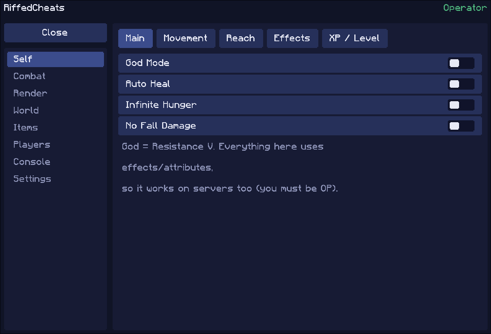
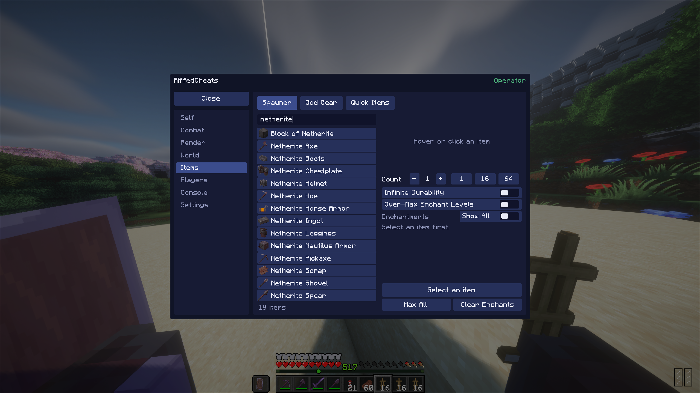
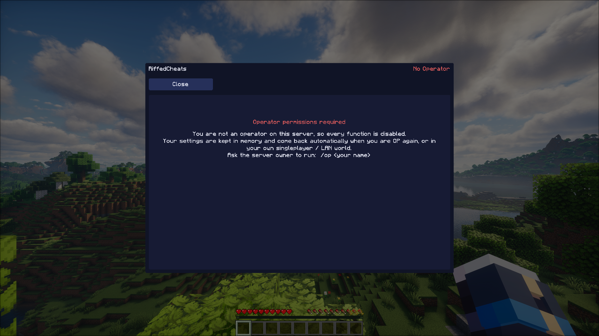
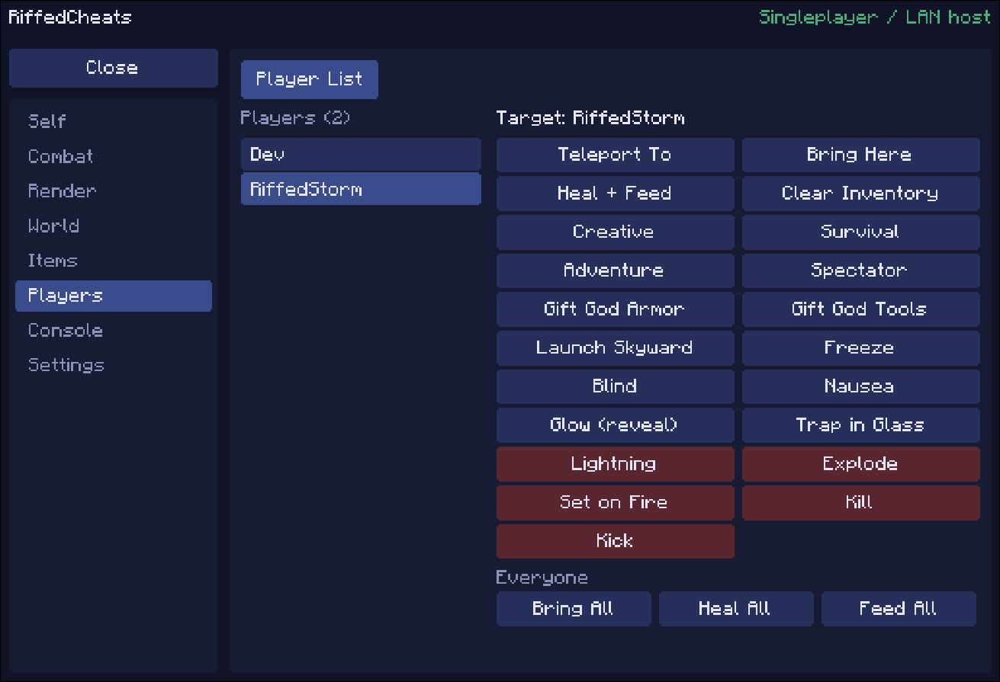
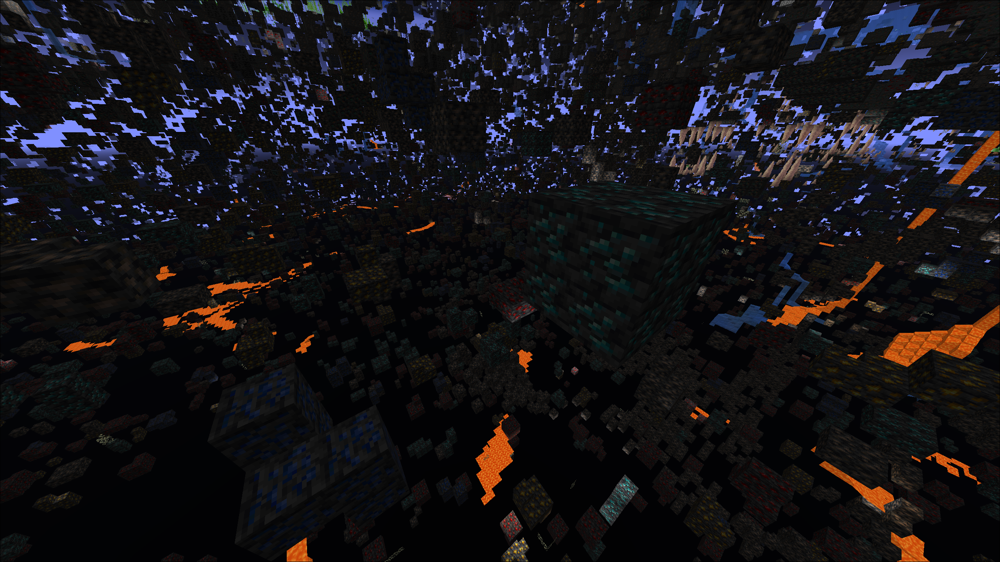
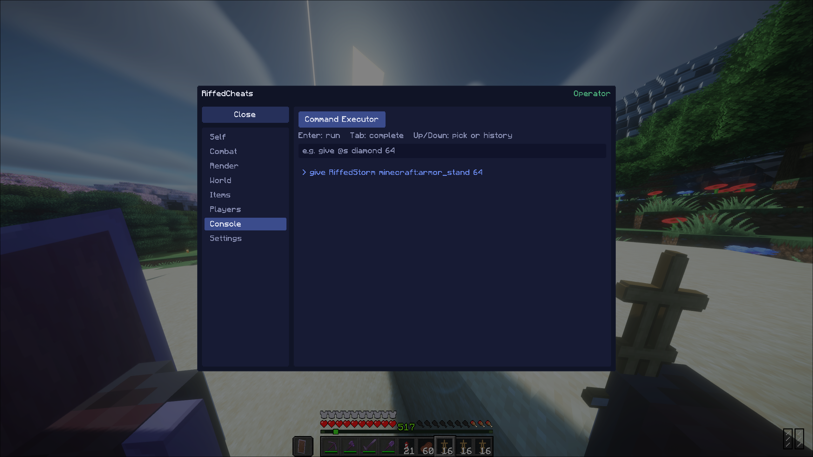

<div align="center">

# RiffedCheats

**An in-game cheat / trainer menu for Minecraft, inspired by CheatUtils and styled like YimMenuV2.**
No localhost website. One key, one clean menu, right inside the game.


<!-- SCREENSHOT 1 (hero) -->
<!-- Save your screenshot as  docs/screenshots/hero.png  and keep the line below as it is. -->


</div>

---

## Table of contents
- [Downloads](#downloads)
- [Features](#features)
- [Who can use it? (Operator rules)](#who-can-use-it-operator-rules)
- [Installing](#installing)
- [Controls](#controls)
- [Screenshots](#screenshots)
- [Building from source](#building-from-source)
- [Server owner notes](#server-owner-notes)
- [FAQ](#faq)
- [Disclaimer](#disclaimer)

---

## Downloads

Grab the file that matches your game from the **[Releases](../../releases)** page.

| Minecraft | Loader | File |
|---|---|---|
| 1.21.1 | NeoForge 21.1.x | `riffedcheats-neoforge-1.21.1-<version>.jar` |
| 26.2 | Fabric Loader 0.19.5+ and Fabric API | `riffedcheats-fabric-26.2-<version>.jar` |

It is a **client-side** mod. You only install it on your own PC. Nothing needs to be installed on the server.

---

## Features

| Category | What you get |
|---|---|
| **Self** | God Mode, Auto Heal, Infinite Hunger, No Fall Damage, Flight (+ speed), Walk Speed, High Jump, Step Assist, Low Gravity, Infinite Jump, Auto Sprint, Extended Reach, 11 more potion effects with level sliders |
| **XP / Level** | Set any level, **freeze** it (checked every tick, a command is only sent when the level really changes, so no lag) |
| **Combat** | Kill Aura, **Always Crit** (works on the ground, no jumping), **No Attack Delay** (spam full-damage hits), Anti-Knockback |
| **Render** | Fullbright, Entity ESP (glow), **Xray** with per-ore toggles, **Freecam** |
| **World** | Time (skips *forward*, so the day counter never resets), weather, difficulty, game rules, teleports, utility commands |
| **Items** | **Item spawner** with search + big icon preview on hover, enchantment editor, count, *Infinite Durability*, over-max enchant levels; **God Armor** and **God Tools** in one click |
| **Players** | Online player list with admin actions: teleport, bring, heal, gamemode, gift God gear, launch, freeze, blind, lightning, kick and more |
| **Console** | Command executor with live suggestions and history, **no "allow cheats" needed in your own world** |
| **Settings** | Autosave (on by default), manual save, disable everything, reset server-side values |

<!-- SCREENSHOT 2 -->


---

## Who can use it? (Operator rules)

The menu is designed to be a **control panel for admins and for your own worlds**:

| Where you are | Result |
|---|---|
| Your own singleplayer world | Fully working. Cheats do **not** have to be enabled. |
| Your own world opened to LAN (you are the host) | Fully working. |
| Someone else's server **and you are an Operator** | Fully working. |
| Someone else's server **and you are not an Operator** | Everything is disabled. The menu only shows a warning. |

The check is live. If an admin runs `/deop <you>` the menu locks itself immediately. When you get `/op` again:

- your toggles and sliders come back exactly as you had them (they are kept in memory)
- your saved config file is **never overwritten** by losing OP

<!-- SCREENSHOT 3 -->


---

## Installing

### NeoForge 1.21.1
1. Install **NeoForge 21.1.x** for Minecraft 1.21.1.
2. Drop `riffedcheats-neoforge-1.21.1-*.jar` into your `mods` folder.

### Fabric 26.2
1. Install **Fabric Loader 0.19.5 or newer** for Minecraft 26.2 using the [Fabric installer](https://fabricmc.net/use/installer/).
2. Install **Fabric API** for 26.2 ([Modrinth](https://modrinth.com/mod/fabric-api) / [CurseForge](https://www.curseforge.com/minecraft/mc-mods/fabric-api)).
3. Drop `riffedcheats-fabric-26.2-*.jar` into your `mods` folder.
4. You need **Java 25** (Minecraft 26.x ships with it).

---

## Controls

| Action | Default |
|---|---|
| Show / hide the menu | **Insert** |

Change it any time in **Options → Controls → Key Binds → RiffedCheats**.

Inside the menu: click rows to toggle, drag sliders, mouse wheel to scroll. In the item spawner and console just start typing. In freecam: WASD, Space up, Shift down, Sprint to go faster.

The menu scales with your **window resolution and GUI scale**, so it looks the same size on 1080p and 4K.

---

## Screenshots

<!-- HOW TO ADD YOUR OWN SCREENSHOTS
  1. Take screenshots in game with F2 (they are saved in .minecraft/screenshots).
  2. Create the folder  docs/screenshots  in this repository.
  3. Copy the images there and rename them to match the names used on this page
     (hero.png, item-spawner.png, no-op.png, players.png, xray.png, console.png).
  4. Commit and push. GitHub shows them automatically.
  To use a different file name, just change the path inside the    line. -->

| Players | Xray |
|---|---|
|  |  |

| Console |
|---|
|  |

---

## Building from source

You need **JDK** and the project's Gradle wrapper. Gradle downloads everything else (Minecraft, NeoForge / Fabric, mappings) by itself.

| Version | JDK | Toolchain |
|---|---|---|
| NeoForge 1.21.1 | **21** | [NeoForge MDK](https://github.com/NeoForgeMDKs/MDK-1.21.1-ModDevGradle) (for the Gradle wrapper), ModDevGradle plugin |
| Fabric 26.2 | **25** | [Fabric example mod](https://github.com/FabricMC/fabric-example-mod) (for the Gradle wrapper), Fabric Loom 1.17 |

```bash
# Fedora Linux example
sudo dnf install adoptium-temurin-java-repository
sudo dnf install temurin-21-jdk    # NeoForge 1.21.1
sudo dnf install temurin-25-jdk    # Fabric 26.2 (or install Temurin 25)

sudo alternatives --config java    # Change Java versions

./gradlew build
# jar ends up in build/libs/
./gradlew runClient     # test in a dev instance
```

Full step-by-step instructions are in `BUILDING.md` inside each source folder.

---

## Server owner notes

The mod does everything through normal vanilla commands, so **no server mod is required**.

- Players need to be **OP (permission level 2+)**. `/deop` instantly cuts their menu.
- **Flight** needs `allow-flight=true` in `server.properties`, otherwise vanilla kicks hovering players.
- Some features change server-side *attributes* (Extended Reach, Step Assist, Low Gravity, Anti-Knockback, No Attack Delay, No Fall). They are reset when the player turns the feature off. If you `/deop` someone while these are on, clean up with, for example:
  ```
  /attribute <player> minecraft:generic.step_height base set 0.6        (1.21.1)
  /attribute <player> minecraft:step_height base set 0.6                (26.2)
  ```
  The player can also press **Settings → Reset Server Attributes + Effects** once they are OP again.
- Potion-style features (God Mode, Speed, ...) are given as 30-second effects and refreshed by the client, so they fade out by themselves after a `/deop`.

---

## FAQ

**Does it work with Sodium / Embeddium?**
Xray hooks the vanilla block renderer. With Sodium-style renderers Xray may do nothing, everything else works.

**Xray does nothing.**
It depends on a Minecraft internal that can change between versions. The rest of the mod still works. Open an issue with your version.

**The menu says "No Operator" in my own singleplayer world.**
It should say *Singleplayer / LAN host*. If not, open an issue.

---

## Disclaimer

For private worlds and servers where everyone agrees. Do not use it on servers that forbid cheating. Not affiliated with Mojang, Microsoft, CheatUtils or YimMenu.

## License

MIT
